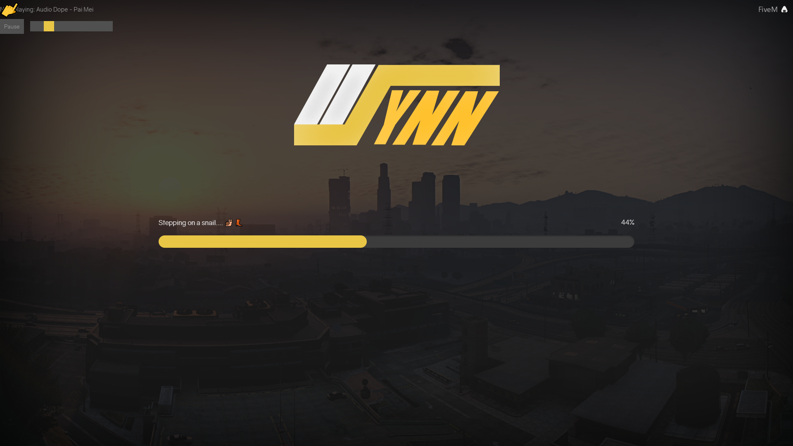
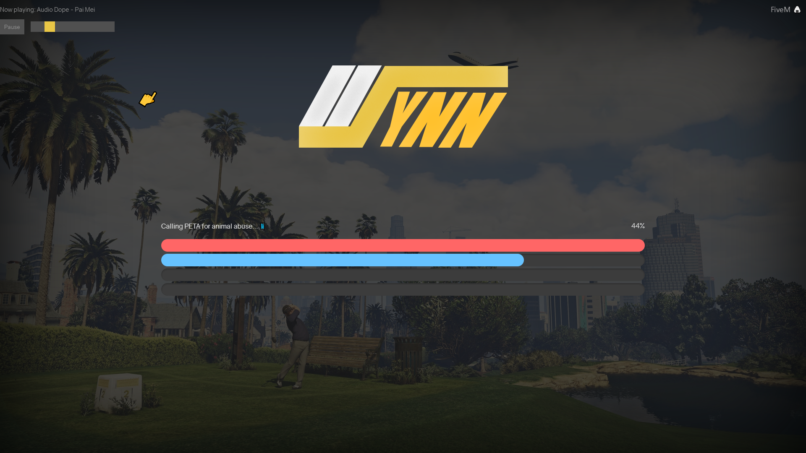
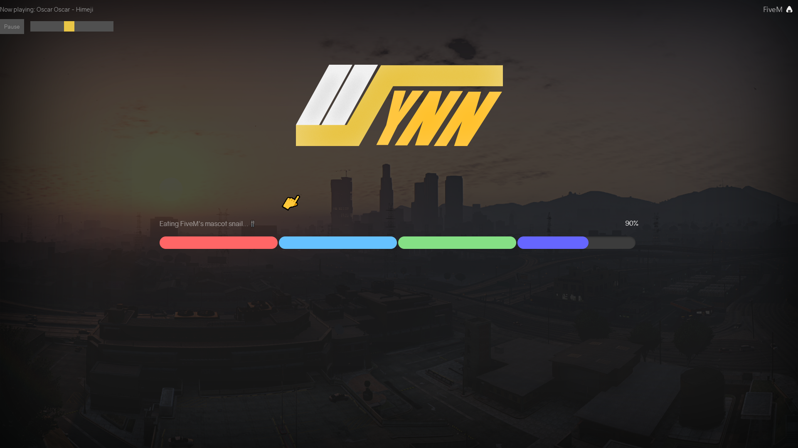

# Synn's Loading Screen

A simple loading screen resource for FiveM.

NOTE THAT I AM NOT THE ORIGINAL CREATOR OF THIS REPOSITORY. I JUST FORKED/REUPLOADED DUE TO THE ORIGINAL CREATOR HAS REMOVED IT AND MAY HAVE ABANDONED IT.

The original creator of this repository is Syntasu.

## Features

- Progressbar  
    - Can have multiple progress bars for each type.
    - Can have single progress bars for all types
- Loading screen image
- Rotating loading messages
- Music player
    - Play videos directly from youtube.
    - Pause and unpause and control volume on the fly.
- Backgrounds
    - Rotating backgrounds with fade in and fade out.
- All of the above can be edited in the config.

## Planned
 
- Open for idea's! <3

## Example

## Installing

1) Download the files from the repository (or see [releases](https://github.com/LogicPlague/synn-loadscreen/releases))

2) Create a folder in your resources folder named "synn-loadscreen"

3) Add the files into the newly create folder in the resources.

4) Add "start synn-loadscreen" to your server.cfg

And you are good to go!

## Known issues

[Unknown] I do not know about any issues at this time, as i was not the original creator of this respetory. Please feel free to let me know.

## Contributing

Feel free to make any pull request, if you believe it is an improvement to the current state.

Feature requests and/or enhancements can be posted into the issues.

I am not an expert for coding, but I do know some basics, so it would nice to get as much help as I can get to do bug fixes and feature requests.

## License

This project falls under the GNU GPLv2 license. (see LICENSE)

## Modification and distribution

If you intend to modify this resource:
- Have a reference back to this GitHub repository
- The source must be publicly available (as stated in GPL 2.0)
- State the changes you made.
- Include the same license (GNU GPL 2.0) (See LICENSE)

If you intend to distibute
- Have a reference back to this GitHub repository or FiveM topic.

## Sources and acknowledgements
The follow source(s) were used to create this resource. This might be useful for further research.

* [Original Creator of Synn's Loading Screen](https://github.com/Syntasu/)
* [Loading Screen guide by Denziel0495](https://forum.fivem.net/t/how-to-custom-loading-screen-with-music/5746)
* [Default loading screen of FiveM](https://github.com/citizenfx/fivem/blob/fde2bb3120cb1bc7a3ecfc31c3ff103896bd0b12/ext/ui-build/data/loadscreen/code.js)
* [TheStonedTurtle's implementation](https://github.com/TheStonedTurtle/FiveM-PercentLoadScreen)
* The Elements/FiveM developers in the [FiveM discord](https://discord.gg/GtvkUsc) for lending a hand.

## Contact

Feel free to contact me about issues, feature request or questions about this loading screen or my old community.

If you wish to contact me:

- Via my own discord, [AdventuresOfSerum Discord](https://discord.gg/ZQRjtGU)
- Via the [FiveM discord](https://discord.gg/GtvkUsc), send me a friend request (PM's are disabled) 
- Via the [FiveM forums](https://forum.cfx.re/u/LogicPlague)

&nbsp; &nbsp;&nbsp; &nbsp; &nbsp;  My Discord is the prefered way of contact.

